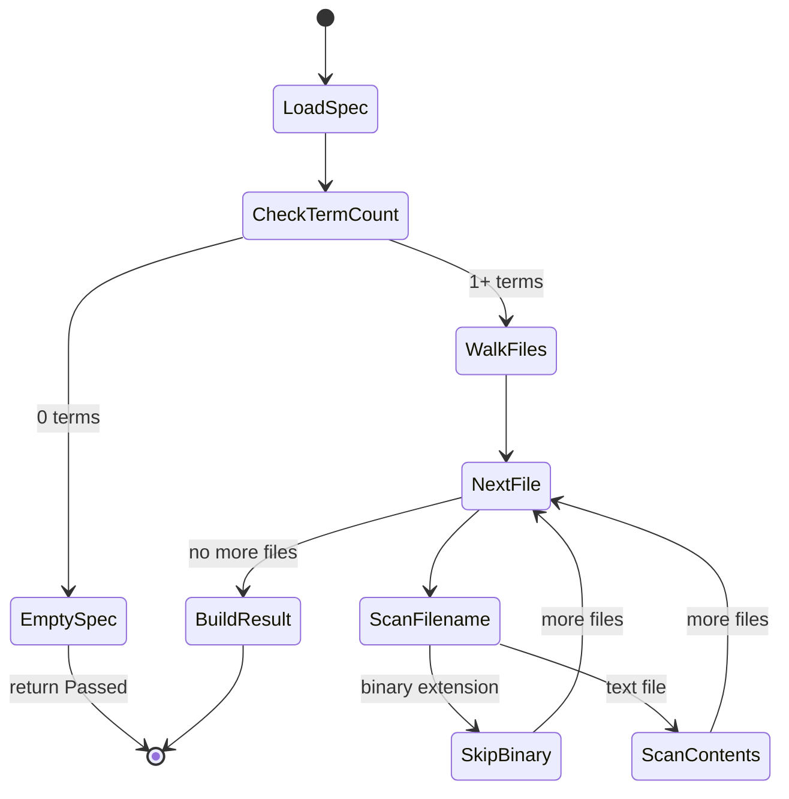

# Architecture

This section maps out the components, shows how they collaborate during a scan, and explains why each boundary exists.

## Components

The content scrubber is built from four types.

**ScrubSpec** is the term dictionary. It loads a spec file and separates entries into two lists: literal strings and compiled regex patterns. Comments and blank lines are stripped during parsing. The spec is immutable after loading — you create a new `ScrubSpec` to pick up changes.

**ContentScanner** is the engine. It takes a `ScrubSpec` and a directory path, walks the file tree, and checks each file against every term. It produces a `ScrubResult`.

**ScrubHit** is one finding. It carries the matched term, the file path, the line number (for content hits), a context snippet, and a flag indicating whether the hit was on the filename or the content.

**ScrubResult** is the aggregate outcome. Its `Passed` property is `true` only when the `Hits` list is empty. It also reports `LiteralCount` and `PatternCount` from the spec for diagnostics.

## Scan Flow



1. **Load spec.** Parse the spec file into literals and compiled regex patterns.
2. **Check term count.** If the spec is empty (no literals, no patterns), return immediately with `Passed = true`. An empty spec blocks nothing.
3. **Walk files.** Enumerate every file in the directory tree recursively.
4. **Scan filename.** Check the filename against every literal (case-insensitive `Contains`) and every regex pattern.
5. **Scan contents.** For text files, read each line and check against every literal (word-boundary regex) and every pattern. Record hits with file path, line number, and context.
6. **Build result.** Collect all hits into a `ScrubResult`. If any hits exist, `Passed` is `false`.

## Literal Matching

Literal terms get word-boundary anchors at runtime:

```csharp
\bHenderson\b
```

This prevents "Hendersonian" from matching "Henderson." The boundary is added only when the term starts or ends with a word character — terms like `@internal` get a boundary only on the trailing side.

## Trail-Journal Example

| Component | Trail-Journal Equivalent |
|---|---|
| ScrubSpec | The publishing guidelines: no landowner names, no raw GPS, no maintenance codes |
| ContentScanner | The editorial review that runs before an entry goes to the public feed |
| ScrubHit | A red-flagged line in the editor's markup: "line 4 mentions Henderson" |
| ScrubResult | The editor's verdict: blocked (2 issues found) or approved (clean) |

A hiker submits three journal entries. The scrubber catches the one with GPS coordinates and the one naming a landowner. The clean entry passes through. The hiker fixes the two flagged entries and re-submits — this time all three pass.
